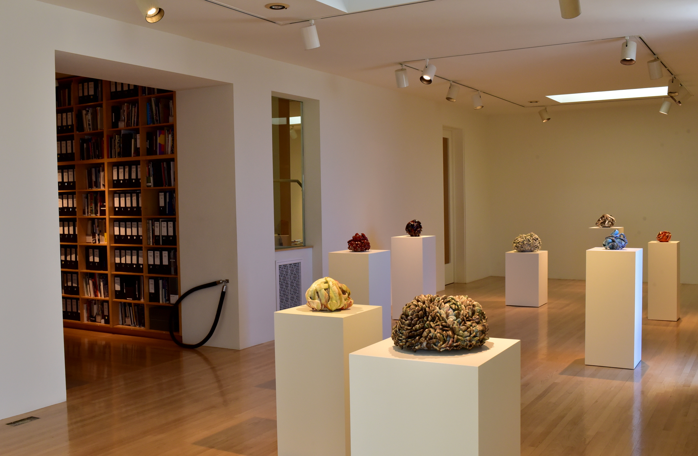

>  Italy meets Cony Island… only in Los Angeles!

## Walking Venice
**What:** *Jane's Walk, Venice Beach*     
**When:** *Saturday 6 May '17*    
**Where:** *Starts at LA Louvre Gallery*    
**Starts:** *In the gallery at 10:00am*   

## Jane's Walk LA Links

* [About Jane's Walk](http://agentof.ch/aos/janes-walk-los-angeles-2017/)  
* [Jane's Walks in Los Angeles](http://janeswalk.org/united-states/los-angeles/)  
* [Jane's Walk LA on Facebook](https://www.facebook.com/janeswalkla/)
* [Jane's Walk: New Taipei, CA](http://jekyll.zucman.com/social/practice/2017/04/23/janeswalk-new-taipei.html)
* [Jane's Walk: Venice, CA](http://jekyll.zucman.com/social/practice/2017/04/30/janeswalk-venice.html)

## Share Your Stories

I'll be "leading" this walk, but I'm hardly an expert on this rich, historical LA treasure. Please chime in with any information and stories you can share.

## LA Louvre 

Founded 42 years ago in Venice, CA, LA Louvre is an art gallery on the edge of contemporary culture. We'll start our walk inside the gallery where we'll meet with Assistant Director Beatrice Shen for a few stories about Venice, the gallery, and Art in Los Angeles.

## Venice Boardwalk

From LA Louvre we'll walk a short block to the beach. One right after the other we'll visit

* Muscle Beach
* The Basketball Courts
* Mark di Suvero Sculpture
* The Art Walls
* The Skate Park

All famous spots that you've probably been to or seen in media.

From there we'll carry on down the boardwalk passing so many food  & clothings shops, street artists & musicians, and visitors from LA and the world.

We could turn up any street, but it only makes sense to turn up the street that shares a name with Pablo Picasso's daughter: *Paloma.* We'll walk down the *tiny street / alley / laneway* and admire the small, adorable homes. If we survive the treacherous Paloma & Pacific street crossing, we'll head up to Main street and *Google Venice.*

## Google Venice

Before it was Google Venice, it was *Digital Domain,* and *Chiat / Day*, and a few other things. Once upon a time you couldn't do "real" advertising west of Chicago. Chiat / Day changed all that. Among many legendary clients was Apple and all of the early Macintosh work. Including Ridley Scott's legendary *1984* commercial for Macintosh. A few years after Apple fired Steve Jobs, they fired Chiat / Day. Years later when he finally returned to Apple, Steve Jobs first act was to fire their then current ad agency and rehire Chiat / Day.

When Chiat / Day wanted to build a new headquarters they hired Frank Gehry to build what would come to be known as the *Ship / Binoculars / Forest* building. Legend has it that sculptors Claes Oldenberg & Coosje van Bruggen were in Gehry's studio one day, looked at the model of the building, picked up a pair of binoculars from a bookshelf, and put them in front of the model.

While the building was under construction Chiat/Day was headquartered behind the site across Hampton Drive. That location would later become the home of Digital Domain until their more recent move down to Playa Vista. While Chiat / Day had both buildings there was some concern that Hampton Drive was just a little bit like the *Frogger* episode of Senifeld. To spare valuable employee lives, Oldenberg & van Bruggen proposed a giant wood screw as a bridge across Hampton connecting the two buildings. The *Binoculars* famously did get built. The *Wood Screw* never did.

## The Rose

Next to *Binoculars-Google-Chiat/Day-Gehry-Oldenberg & van Bruggen*, on the corner of Rose & Main, is the former *Rose Cafe,* recently remodeled and redubbed *The Rose.* LA Louvre opened in 1975 and *The Rose Cafe* opened 4 years later in 1979. Across the street from *The Rose* is a *CVS Pharmacy* with a giant Jonathan Borofsky *Ballerina Clown* as its front facade. 

We'll finish our walk at *The Rose* and settle in for some optional coffee, snacks, lunch, or whatever you like. We can stay for as much conversation as you like and optionally walk back toward LA Louvre together.

### LA Louvre Gallery
45 North Venice Boulevard  
Venice, California 90291  
310.822.4955  
[lalouvre.com](http://www.lalouver.com/)

### The Rose
220 Rose Ave  
Venice, CA 90291  
310-399-0711  
[rosecafevenice.com](http://rosecafevenice.com/)

